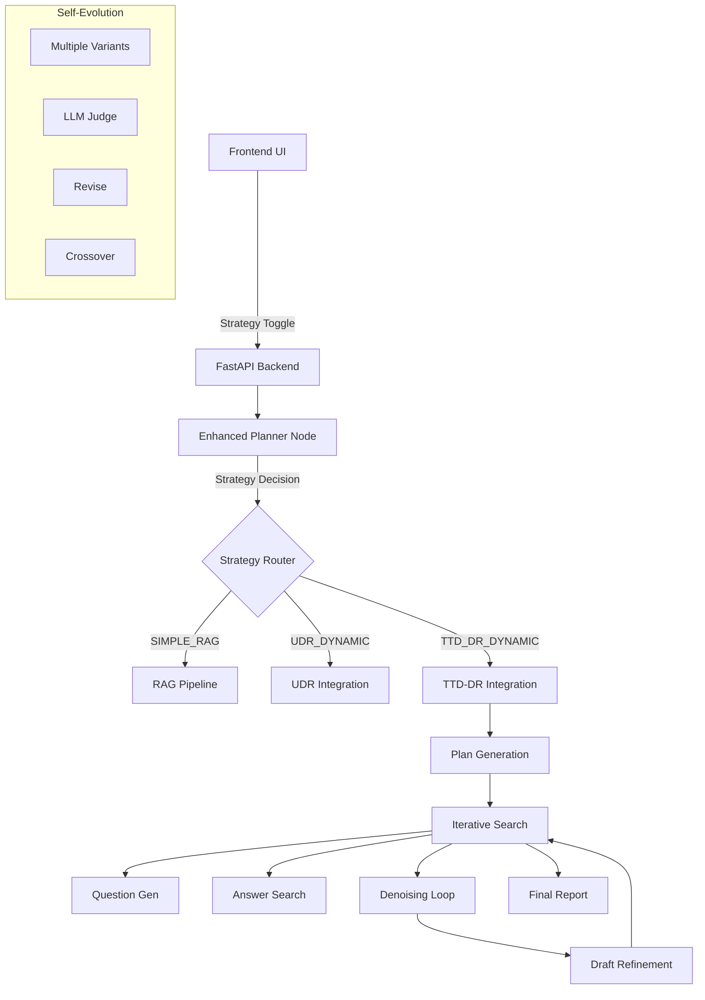

# TTD-DR (Test-Time Diffusion Deep Researcher) Architecture Plan

**Date**: November 21, 2025  
**Status**: 🏗️ Architecture & Planning Phase  
**Reference**: [Google Research Blog](https://research.google/blog/deep-researcher-with-test-time-diffusion/)

---

## Executive Summary

Implement Google's Test-Time Diffusion Deep Researcher (TTD-DR) as an alternative research strategy alongside the existing NVIDIA UDR integration. Users can select between UDR and TTD-DR via a UI toggle, allowing comparison between:

- **UDR**: Strategy-as-code approach (compiles natural language → Python)
- **TTD-DR**: Diffusion-based iterative refinement (draft → denoise → polish)

---

## Core Concepts from Google Research

### 1. Test-Time Diffusion Process
- **Initial Draft**: Generate a "noisy" preliminary draft
- **Denoising Steps**: Iteratively refine using retrieved information
- **Final Polish**: Converge to high-quality report

### 2. Three-Stage Architecture
1. **Research Plan Generation**: Structured outline of key areas
2. **Iterative Search**: 
   - Search Question Generation (2a)
   - Answer Searching with RAG (2b)
3. **Final Report Generation**: Synthesis of all information

### 3. Key Innovations
- **Component-wise Self-Evolution**: Each stage improves via environmental feedback
- **Report-level Denoising**: Draft guides next search queries
- **Crossover & Merging**: Multiple variants merged for best results

---

## Proposed Architecture

### System Overview



### File Structure

```
aira/src/aiq_aira/
├── hackathon_agent.py          # Modified to support 3 strategies
├── udr_integration.py           # Existing UDR (strategy-as-code)
├── ttd_dr_integration.py        # NEW: TTD-DR implementation
├── ttd_dr/                      # NEW: TTD-DR components
│   ├── __init__.py
│   ├── plan_generator.py        # Stage 1: Research plan
│   ├── search_engine.py         # Stage 2: Iterative search
│   ├── denoiser.py             # Report-level denoising
│   ├── self_evolution.py       # Component-wise optimization
│   └── report_synthesizer.py   # Stage 3: Final report
└── research_strategy.py        # NEW: Strategy selector interface

frontend/app/
├── components/
│   ├── StrategyToggle.tsx      # NEW: UDR/TTD-DR toggle
│   └── ResearchFlowVisualizer.tsx # Modified: Show different flows
└── page.tsx                     # Modified: Include toggle

backend/
└── main.py                      # Modified: Handle strategy selection
```

---

## Implementation Plan

### Phase 1: Core Infrastructure (Week 1)

#### 1.1 Strategy Selection Layer
**Files to Create:**
- `aira/src/aiq_aira/research_strategy.py`

```python
from enum import Enum
from abc import ABC, abstractmethod

class ResearchStrategy(Enum):
    SIMPLE_RAG = "simple_rag"
    UDR_DYNAMIC = "udr_dynamic"
    TTD_DR_DYNAMIC = "ttd_dr_dynamic"

class BaseResearchIntegration(ABC):
    @abstractmethod
    async def execute_strategy(self, query: str, context: dict) -> dict:
        pass
```

#### 1.2 Enhanced Agent State
**File to Modify:** `hackathon_agent.py`

```python
class HackathonAgentState(TypedDict):
    # Existing fields...
    
    # Strategy selection
    selected_strategy: ResearchStrategy
    
    # UDR fields (existing)
    udr_strategy: str
    udr_result: dict
    
    # TTD-DR fields (new)
    ttd_dr_draft: str           # Current draft
    ttd_dr_iterations: list     # Denoising history
    ttd_dr_search_qa: list      # Q&A pairs
    ttd_dr_plan: dict           # Research plan
    ttd_dr_variants: list       # Self-evolution variants
```

---

### Phase 2: TTD-DR Core Implementation (Week 1-2)

#### 2.1 Main Integration Module
**File to Create:** `aira/src/aiq_aira/ttd_dr_integration.py`

```python
class TTDDRIntegration(BaseResearchIntegration):
    """
    Test-Time Diffusion Deep Researcher implementation.
    Based on Google Research (2025).
    """
    
    def __init__(self, 
                 llm: BaseChatModel,
                 rag_url: str,
                 nemotron_nim_url: str,
                 max_iterations: int = 5,
                 num_variants: int = 3):
        self.plan_generator = ResearchPlanGenerator(llm)
        self.search_engine = IterativeSearchEngine(llm, rag_url)
        self.denoiser = ReportDenoiser(llm)
        self.self_evolver = SelfEvolution(llm, num_variants)
        self.synthesizer = ReportSynthesizer(llm, nemotron_nim_url)
        self.max_iterations = max_iterations
    
    async def execute_strategy(self, query: str, context: dict) -> TTDDRResult:
        # Stage 1: Generate research plan
        plan = await self.plan_generator.generate_plan(query)
        
        # Initialize draft (noisy starting point)
        draft = await self._generate_initial_draft(query, plan)
        
        # Stage 2: Iterative search with denoising
        search_history = []
        for i in range(self.max_iterations):
            # Generate search questions based on current draft
            questions = await self.search_engine.generate_questions(
                draft, plan, search_history
            )
            
            # Search and retrieve answers (with self-evolution)
            answers = await self._search_with_evolution(questions)
            search_history.extend(zip(questions, answers))
            
            # Denoise: Revise draft with new information
            draft = await self.denoiser.denoise_draft(
                draft, answers, plan
            )
            
            # Check convergence
            if await self._has_converged(draft, i):
                break
        
        # Stage 3: Generate final report
        final_report = await self.synthesizer.generate_final_report(
            draft, search_history, plan
        )
        
        return TTDDRResult(
            success=True,
            final_report=final_report,
            research_plan=plan,
            iterations=i + 1,
            search_history=search_history
        )
```

#### 2.2 Component Modules

**2.2.1 Plan Generator**
```python
# ttd_dr/plan_generator.py
class ResearchPlanGenerator:
    """Stage 1: Generate structured research plan."""
    
    async def generate_plan(self, query: str) -> ResearchPlan:
        # Generate key research areas
        # Output structured outline
        pass
```

**2.2.2 Search Engine**
```python
# ttd_dr/search_engine.py
class IterativeSearchEngine:
    """Stage 2a & 2b: Question generation and answer searching."""
    
    async def generate_questions(self, draft: str, plan: dict, 
                                history: list) -> list[str]:
        # Based on draft gaps, generate targeted questions
        pass
    
    async def search_answers(self, questions: list[str]) -> list[str]:
        # RAG-based answer retrieval
        pass
```

**2.2.3 Denoiser**
```python
# ttd_dr/denoiser.py
class ReportDenoiser:
    """Report-level denoising with retrieval."""
    
    async def denoise_draft(self, draft: str, new_info: list, 
                           plan: dict) -> str:
        # Incorporate new information
        # Verify existing claims
        # Fill gaps
        # Improve coherence
        pass
```

**2.2.4 Self-Evolution**
```python
# ttd_dr/self_evolution.py
class SelfEvolution:
    """Component-wise optimization via self-evolution."""
    
    async def evolve_answers(self, initial_answers: list) -> list:
        # Generate variants
        # Get feedback (LLM-as-judge)
        # Revise based on feedback
        # Crossover best variants
        pass
```

---

### Phase 3: Frontend Integration (Week 2)

#### 3.1 Strategy Toggle Component
**File to Create:** `frontend/app/components/StrategyToggle.tsx`

```typescript
interface StrategyToggleProps {
  value: 'udr' | 'ttd_dr';
  onChange: (value: 'udr' | 'ttd_dr') => void;
}

export function StrategyToggle({ value, onChange }: StrategyToggleProps) {
  return (
    <div className="flex items-center gap-4 p-4 bg-gray-800 rounded-lg">
      <span className="text-gray-300">Research Strategy:</span>
      <div className="flex gap-2">
        <button
          onClick={() => onChange('udr')}
          className={`px-4 py-2 rounded ${
            value === 'udr' 
              ? 'bg-blue-600 text-white' 
              : 'bg-gray-700 text-gray-400'
          }`}
        >
          <div className="flex items-center gap-2">
            <CodeIcon />
            <span>UDR (Strategy-as-Code)</span>
          </div>
        </button>
        <button
          onClick={() => onChange('ttd_dr')}
          className={`px-4 py-2 rounded ${
            value === 'ttd_dr' 
              ? 'bg-green-600 text-white' 
              : 'bg-gray-700 text-gray-400'
          }`}
        >
          <div className="flex items-center gap-2">
            <IterateIcon />
            <span>TTD-DR (Diffusion)</span>
          </div>
        </button>
      </div>
    </div>
  );
}
```

#### 3.2 Flow Visualizer Updates
**File to Modify:** `frontend/app/components/ResearchFlowVisualizer.tsx`

- Show different flows based on selected strategy
- UDR: Code compilation → Execution
- TTD-DR: Draft → Denoise iterations → Final

#### 3.3 Main Page Integration
**File to Modify:** `frontend/app/page.tsx`

```typescript
const [researchStrategy, setResearchStrategy] = useState<'udr' | 'ttd_dr'>('udr');

// Pass strategy to backend
const handleSubmit = async () => {
  const response = await fetch('/research/stream', {
    method: 'POST',
    body: JSON.stringify({
      topic,
      strategy: researchStrategy,
      // ... other params
    })
  });
};
```

---

### Phase 4: Backend Integration (Week 2)

#### 4.1 API Updates
**File to Modify:** `backend/main.py`

```python
class ResearchRequest(BaseModel):
    topic: str
    strategy: str = "udr"  # "udr" or "ttd_dr"
    collection: str = "default"
    report_organization: Optional[str] = None

@app.post("/research/stream")
async def research_stream(request: ResearchRequest):
    # Initialize appropriate integration based on strategy
    if request.strategy == "ttd_dr":
        integration = ttd_dr_integration
    else:
        integration = udr_integration
    
    # Update config
    config["configurable"]["selected_strategy"] = request.strategy
    config["configurable"][f"{request.strategy}_integration"] = integration
```

#### 4.2 Planner Node Updates
**File to Modify:** `hackathon_agent.py`

```python
async def planner_node(state: HackathonAgentState, config: RunnableConfig):
    selected_strategy = config["configurable"].get("selected_strategy", "udr")
    
    # Existing complexity analysis...
    
    if complexity == "simple":
        strategy = "SIMPLE_RAG"
    elif selected_strategy == "ttd_dr":
        strategy = "TTD_DR_DYNAMIC"
    else:
        strategy = "UDR_DYNAMIC"
    
    return {
        "selected_strategy": selected_strategy,
        "strategy_decision": strategy,
        # ...
    }
```

---

## Key Differentiators

### UDR vs TTD-DR Comparison

| Aspect | UDR (NVIDIA) | TTD-DR (Google) |
|--------|--------------|-----------------|
| **Core Approach** | Strategy-as-code | Diffusion process |
| **Initial State** | Natural language plan | Noisy draft |
| **Refinement** | Code compilation | Iterative denoising |
| **Search Strategy** | Embedded in code | Draft-guided |
| **Evolution** | N/A | Self-evolution with variants |
| **Convergence** | Single execution | Multiple iterations |
| **Strength** | Precise execution | Coherent refinement |

---

## Implementation Timeline

### Week 1: Foundation
- [ ] Day 1-2: Core infrastructure (strategy selector, base classes)
- [ ] Day 3-4: TTD-DR main integration module
- [ ] Day 5: Component stubs (plan, search, denoise)

### Week 2: Core Implementation
- [ ] Day 1-2: Implement 3-stage pipeline
- [ ] Day 3: Self-evolution algorithm
- [ ] Day 4: Denoising logic
- [ ] Day 5: Integration testing

### Week 3: UI & Polish
- [ ] Day 1-2: Frontend components (toggle, visualizer)
- [ ] Day 3: Backend API updates
- [ ] Day 4: End-to-end testing
- [ ] Day 5: Documentation & benchmarking

---

## Testing Strategy

### Unit Tests
```python
# test_ttd_dr.py
async def test_plan_generation():
    # Test research plan quality
    
async def test_denoising_iteration():
    # Test draft improvement
    
async def test_self_evolution():
    # Test variant generation and merging
```

### Integration Tests
```python
async def test_ttd_dr_vs_udr():
    # Same query, different strategies
    # Compare: quality, latency, coherence
```

### Benchmarks (from Google paper)
- DeepConsult dataset (long-form reports)
- HLE-Search (multi-hop reasoning)
- GAIA dataset (research tasks)

---

## Risk Analysis

### Technical Risks
1. **Complexity**: TTD-DR has more moving parts than UDR
   - Mitigation: Modular design, extensive logging
   
2. **Latency**: Multiple iterations could be slow
   - Mitigation: Parallel search, early convergence detection
   
3. **LLM Costs**: Self-evolution uses multiple LLM calls
   - Mitigation: Configurable variant count, caching

### Integration Risks
1. **State Management**: More complex state with drafts/iterations
   - Mitigation: Clear state schema, proper serialization
   
2. **UI Complexity**: Visualizing iterative process
   - Mitigation: Progressive disclosure, summary view

---

## Success Metrics

### Performance Metrics
- **Quality**: Win rate vs baseline (target: >70%)
- **Latency**: Time to final report (target: <60s)
- **Coherence**: Draft improvement per iteration
- **Convergence**: Average iterations needed (target: 3-5)

### User Metrics
- **Preference**: Which strategy users choose
- **Satisfaction**: Report quality ratings
- **Understanding**: Can users see the difference?

---

## Configuration & Tuning

### TTD-DR Parameters
```python
TTD_DR_CONFIG = {
    "max_iterations": 5,          # Denoising iterations
    "num_variants": 3,             # Self-evolution variants
    "convergence_threshold": 0.95, # When to stop iterating
    "feedback_model": "gemini-pro", # LLM-as-judge
    "denoising_temperature": 0.7,   # Creativity in revisions
    "plan_detail_level": "high",    # Research plan granularity
}
```

---

## Documentation Plan

### User Documentation
1. **Strategy Selection Guide**: When to use UDR vs TTD-DR
2. **Visual Explanation**: How each approach works
3. **Example Outputs**: Side-by-side comparisons

### Developer Documentation
1. **Architecture Overview**: Component interactions
2. **Extension Guide**: Adding new denoisers/evolvers
3. **Debugging Guide**: Understanding the iterative flow

---

## Open Questions for Discussion

1. **Default Strategy**: Should we default to UDR or TTD-DR?
2. **Hybrid Mode**: Could we combine both approaches?
3. **Caching Strategy**: How to cache intermediate drafts?
4. **Visualization Detail**: How much of the process to show?
5. **Evaluation Metrics**: Which metrics matter most?

---

## Next Steps

1. **Review & Approve**: Get stakeholder buy-in on architecture
2. **Prototype**: Build minimal TTD-DR implementation
3. **Benchmark**: Compare with UDR on test queries
4. **Iterate**: Refine based on results
5. **Deploy**: Roll out with feature flag

---

**Status**: ✅ Ready for Review  
**Estimated Effort**: 3 weeks (2 developers)  
**Dependencies**: Existing UDR implementation, LangGraph, NIMs
